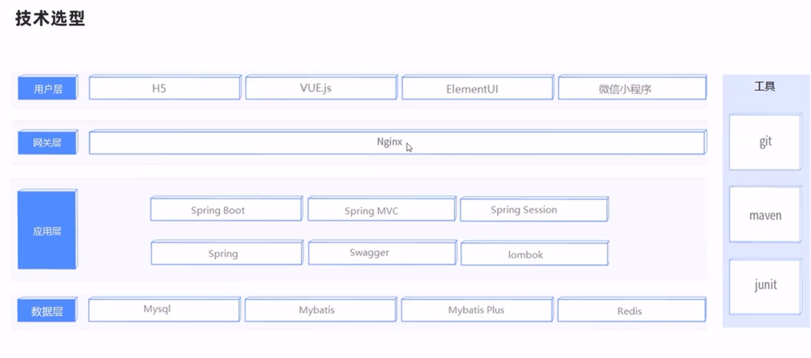
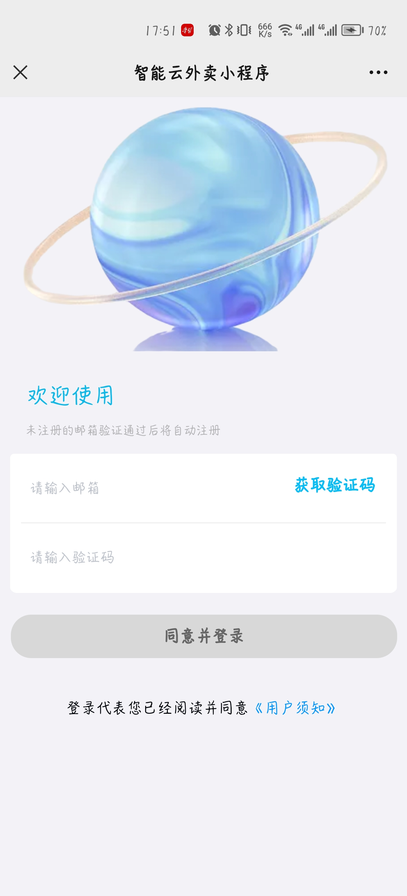
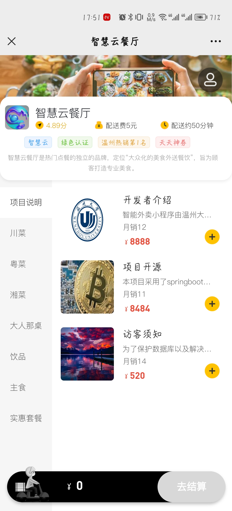
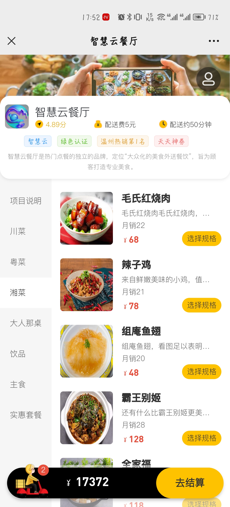
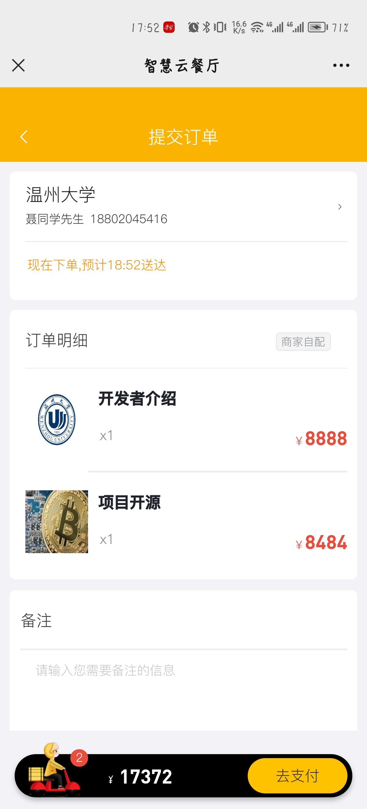
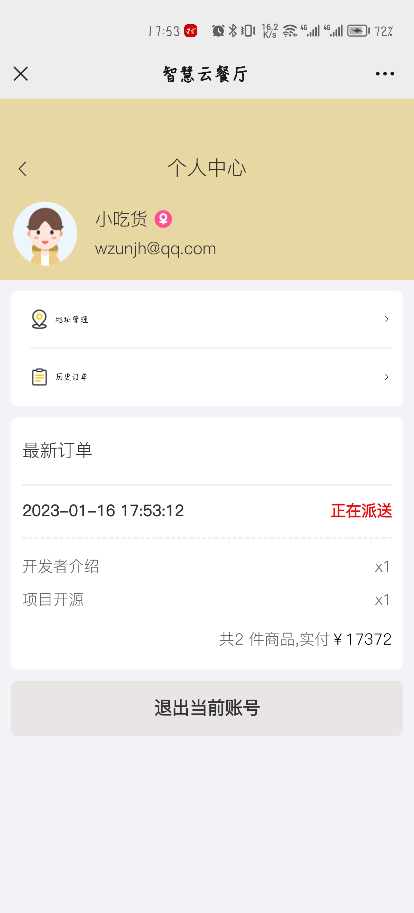

# reggie

#### 介绍
智能外卖项目(wzunjh.top)

#### 软件架构
说明:后端利用mysql，redis，mybatisplus，sping-cache，springMVC，springboot等技术和框架搭建的外卖服务平台

#### 部分功能截图
|   |   |   |
|---|---|---|
|   |   | |

#### 后台管理端
| MOE8%7B4%7BS%25MJX(K4G72TD.png) |
|--|

#### 参与贡献

1.  前端：传智播客
2.  设计思维：商务智能
3.  外观：美团外卖
4.  后端：wzunjh

#### 使用说明
1.修改配置文件application.properties，数据库的连接等。

2.本地或者服务器启动时，提前开启redis服务

3.CommonController修改文件上传和下载的路径

4.同时访问后台管理系统和前台小程序时请使用两个浏览器分别访问（或者操作完一个系统退出再进行另外一个系统操作），否则会导致session冲突

#### 在线测试使用
网站: [wzunjh.top](http://wzunjh.top)